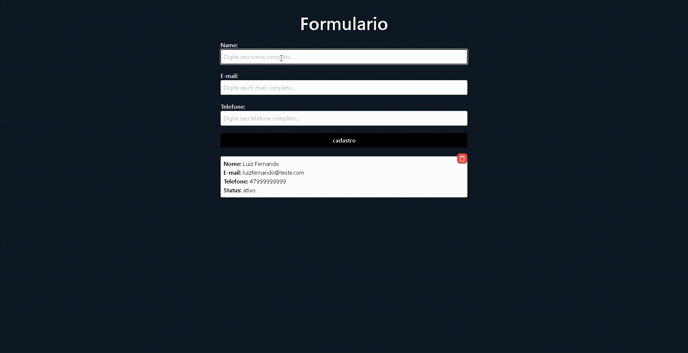

# Formulario de capitação de informações⚙️

Esta solução foi desenvolvida para captar informações de leads e clientes, utilizando APIs integradas a um banco de dados.

## Tabela de conteúdos📑

- [Visão Geral](#visão-geral)
  - [O Desafio](#o-desafio)
  - [Screenshot](#screenshot)
  - [Links](#links)
- [Meu processo](#meu-processo)
  - [Construido com](#construido-com)
  - [O que eu aprendi](#o-que-eu-aprendi)
- [Autor](#autor)

## Visão Geral👀

### O Desafio

- O desafio consiste em desenvolver o back-end do projeto utilizando a linguagem TypeScript para criar APIs com o Prisma, integrando-as a um banco de dados MongoDB. Já o front-end foi desenvolvido com o uso do Tailwind CSS, combinado com ferramentas do React.

### O que eu aprendi

- Neste projeto, aprendi a utilizar o Prisma para criar diversas APIs conectadas a um banco de dados de minha preferência. Optei pelo MongoDB por oferecer uma versão gratuita, o que facilitou a implementação e os testes.

### Screenshot

## Meu processo🚀

### Construído com

- Typescript (Node.js)
- JavaScript
- Prisma
- React
- CSS

## Autor🧙🏻

- LikedIn - [@Luiz Fernando Streme Vogel](https://www.linkedin.com/in/luiz-fernando-streme-vogel-aaa363226/)

